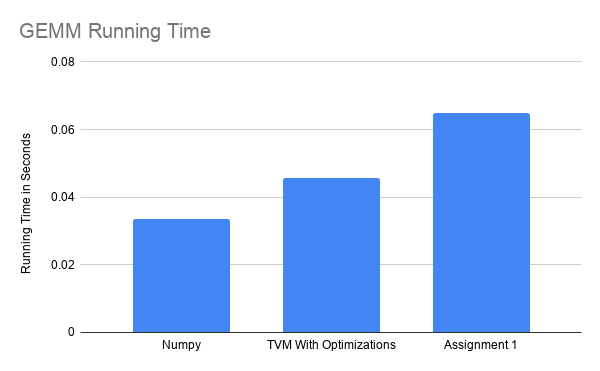

# Implementation of GEMM using TVM

Performance Results for multiplying two 1024 x 1024 :

* Numpy : 0.033671 s 
* Without optimizations: 10.314416 s 
* With tvm optimizations: 0.045817 s
* Assignment 1: 0.06561 s

reference: https://docs.tvm.ai/tutorials/optimize/opt_gemm.html
